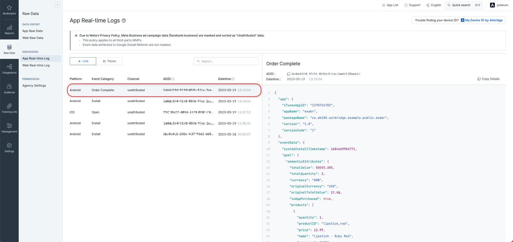

# Airbridge React Native v4 Example

## How to run
### Step 1: Clone This Repository

1.  Open your terminal and navigate to the directory where you want to clone the eaxmple app.
2.  Execute the following command to clone the repository:
    ```bash
    git clone https://github.com/ab180/airbridge-react-native-example
    ```

### Step 2: Install Airbridge SDK
1. Install airbridge-react-native-sdk using npm.
    ```bash
    npm install airbridge-react-native-sdk
    ```
2. Install iOS dependencies using CocoaPods. Android dependencies are installed automatically.
    ```bash
    cd ios; pod install
    ```

## Test guide

### Sending Events
How to send events**
Click `Send Event` button to send event

**Check on Real-time Logs**


Event information sent from the Airbridge SDK should be seen in the "Airbridge dashboard → `Raw Data` → `App Real-time Log`" tab.

### Deeplink settings
To set up a deep link, refer to the [Set up deep linking](https://help.airbridge.io/en/developers/react-native-sdk-v4#set-up-deep-linking) link

### Deeplink test

You can test deep links using the following two methods:
1. Click on a custom scheme deep link starting with exabr://
2. Click on the Airbridge tracking link: https://abr.ge/4mw2j8

Confirm that the app launches and displays the deep link information.